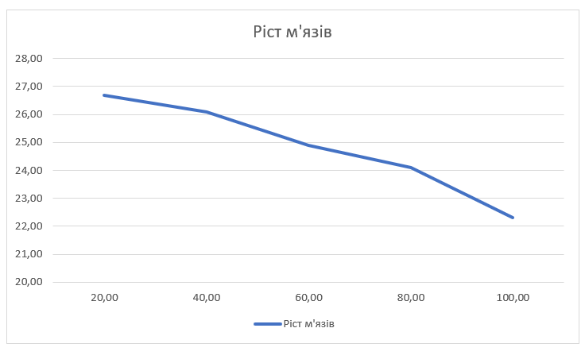

## Комп'ютерні системи імітаційного моделювання
## СПм-22-6, **Лисенко Назар Олександрович**
### Лабораторна робота №**2**. Редагування імітаційних моделей у середовищі NetLogo

 

### Варіант 12, модель у середовищі NetLogo:
[Muscle Development](http://www.netlogoweb.org/launch#http://www.netlogoweb.org/assets/modelslib/Sample%20Models/Biology/Muscle%20Development.nlogo)

 

### Внесені зміни у вихідну логіку моделі, за варіантом:

**Додано до моделі вплив харчування на можливість зростання м'язової маси.**

Додано слайдер "food". Якість їжі визначається по 10 бальній шкалі:

Якість їжі впливає на виділення анаболічного та катаболічного гормону. Чим краща їжа, тим більше має виділятись катаболіка і тим менше анаболіка. Для цього внесені зміни у процедуру perform-daily-activity:
<pre>
to perform-daily-activity
  
  ;; simulate hormonal effect of lifestyle activities like watching TV and working
  ask muscle-fibers [
    set catabolic-hormone catabolic-hormone + 2.0 * (log fiber-size 10)
    set anabolic-hormone anabolic-hormone + 2.5 * (log fiber-size 10)
  ]
  
  ;; simulate hormonal effect of food intake
 ask patches [
    set anabolic-hormone anabolic-hormone + (log food 10) * 2
    set catabolic-hormone catabolic-hormone + (log food 10) * 1.6
  ]
end
</pre>

**Додано регулюємі користувачем параметри, що визначають вірогідність та міру відхилення від вказаних початкових значень інтенсивності тренувань, кількості годин сну та днів між тренуваннями.**

Додано глобальні змінні, які відповідають за відхилення:
<pre>
  intensity-deviation
  sleep-deviation       
  days-deviation 
</pre>

Ініціалізація цих змінних:
<pre>
  set intensity-deviation 10 ; adjust as needed
  set sleep-deviation 1 ; adjust as needed
  set days-deviation 1 ; adjust as needed
</pre>

Створено процедуру, яка відповідає за зміну розміру відхилення. Максимальне відхилення для інтенсивності 50, годин сну 5, днів 5.
<pre>
 to apply-temporary-deviation
  ;; apply temporary deviation to training intensity, hours of sleep, and days between trainings
  ifelse (random-float 1.0 < deviation-probability) [
    set intensity-deviation 10 * measure-deviation
    set sleep-deviation 1 * measure-deviation     
    set days-deviation  1 * measure-deviation   
  ]
  [
    set intensity-deviation 0
    set sleep-deviation 0
    set days-deviation 0
  ]
  
  if intensity-deviation > intensity [set intensity-deviation intensity]
  if sleep-deviation > hours-of-sleep [set sleep-deviation hours-of-sleep]
  if days-deviation > days-between-workouts or days-between-workouts - days-deviation = 0  [set days-deviation days-between-workouts - 1]
end
</pre>

До всіх значень у моделі, які відповідають за інтенсивність тренувань, кількості годин сну та днів між тренуваннями додано відхвилення. Всі по одному шаблону:
<pre>
  (intensity - intensity-deviation)
</pre>

### Внесені зміни у вихідну логіку моделі, на власний розсуд:

**Додано вплив віку на ріст м'язів.**

Причина, через яку люди похилого віку слабшають, це гормональні зміни. У чоловіків із віком знижується рівень тестостерону, який сильно впливає на ріст м'язів. А у літніх жінок спостерігається зниження гормонів, які виробляють яєчники. Вони грають дуже важливу роль у зростанні м'язових тканин.

Додана процедура age-rate. Чим старіша людина, тим сильніше в неї руйнуються м'язи з часом. Також раз в 365 тіків вік людини збільшується на 1 рік.
<pre>
to age-rate
  ask muscle-fibers [
    ;; simulate the long-term effects of aging
    if random-float 200 < age
    [set fiber-size (fiber-size - (age / 1400) )]
  ]
  
  if (ticks + 1) mod 365 = 0 [set age age + 1]
end
</pre>

Фінальний код моделі та її інтерфейс доступні за [посиланням](Muscle_Development.nlogo).
 

## Обчислювальні експерименти
### 1. Вплив ймовірності відхиленя на ріст м'язів

Досліджується залежність росту м'язів протягом певної кількості тіків (1000) від  ймовірності відхиленя.
Експерименти проводяться при 20-100 ймовірності відхиленя, з кроком 20, усього 5 симуляцій.  
Інші керуючі параметри мають значення за замовчуванням:
- **lift**: on
- **intensity**: 95
- **hours-of-sleep**: 8
- **days-between-workouts**: 10
- **%slow-twitch-fibers**: 50
- **measure-deviation**: 3
- **food**:7
- **age**: 25

<table>
<thead>
<tr><th>Ймовірність відхиленя</th><th>Ріст м'язів</th></tr>
</thead>
<tbody>
<tr><td>20</td><td>26,7</td></tr>
<tr><td>40</td><td>26,1</td></tr>
<tr><td>60</td><td>24,9</td></tr>
<tr><td>80</td><td>24,1</td></tr>
<tr><td>100</td><td>22,3</td></tr>
</tbody>
</table>

З результатів видно, що збільшення ймовірності відхилення призводить до зменшення росту м'язів. Це може бути пов'язано з тим, що великі відхилення від нормальних значень параметрів (таких як тривалість тренувань, тривалість сну і т.д.) можуть негативно впливати на ефективність тренувань.

 
